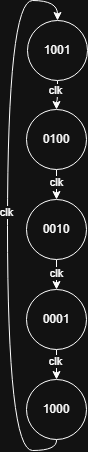

# 4-bit LFSR with BRAM Interface

This project implements a 4-bit Linear Feedback Shift Register (LFSR) interfaced with an 8-entry, 4-bit wide Block RAM (BRAM) on a Zybo FPGA. The LFSR generates a pseudo-random sequence, stored in a circular BRAM buffer, using multi-clock domain logic (125 MHz for BRAM, 10 MHz for LFSR/write).

## Project Overview
- **Objective**: Generate and store a 4-bit pseudo-random sequence in BRAM.
- **Tools**: Vivado 2016.4, Verilog, Zybo FPGA.
- **Features**:
  - 4-bit LFSR with XOR feedback (bits 3 and 1), period of 15 states.
  - 8-entry BRAM as a circular buffer with modulo-8 addressing.
  - Multi-clock domain: 125 MHz for BRAM logic, 10 MHz for LFSR and writes.
- **Test Cases**: Verified BRAM storage after 8 cycles and overwriting after 11 cycles.

## Repository Structure
- `src/`: Verilog modules (`LFSR.v`, `bram_interface.v`), testbench (`bram_tb.v`), and Tcl script (`bram_tb.tcl`).
- `docs/`: Lab report (`ECE_440_Lab_4_Report.pdf`), Draw.io file (`lfsr_state_diagram.drawio`).
- `images/`: Simulation outputs and state diagram.

## State Diagram


## How to Run
1. Clone the repository:
   ```bash
   git clone https://github.com/TWi5/lfsr-bram-verilog.git
